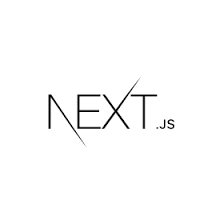

# Movie

## プロジェクト紹介

TMDB(The Movie DataBase)はReactプロジェクトでAPIを活用して映画検索、詳細情報を確認する機能を提供します。

 

## 技術

|               UI ライブラリ                |                      ルーター                       |                  ステェィトゥ管理                  |                非同期処理                 |
| :----------------------------------------: | :-----------------------------------------------: | :----------------------------------------: | :---------------------------------------------: |
|  |  |  |  |

|                 オープンAPI                  |
| :---------------------------------------: |
|  |

 

 

## プロジェクトを通じて学んだこと

* Reduxを使用してステェィトゥ管理をしました。
* Redux-Sagaを使用して非同期で変化するステェィトゥ管理をしました。
* Styeld componentsを使用して各コンポーネントをCSS-in-JS方式でスタイリングをしました。
* オープンAPIとaxiosを使ってデータを読み込みました。

 

### 追加する項目
- [x]  レスポンシブウェブデザイン
- [x]  Redux, Redux-saga適応
- [x]  Nextでページ及びルーター構築
- [x]  Style Component

- [ ]  検索機能
- [ ]  UI/UXテスト

